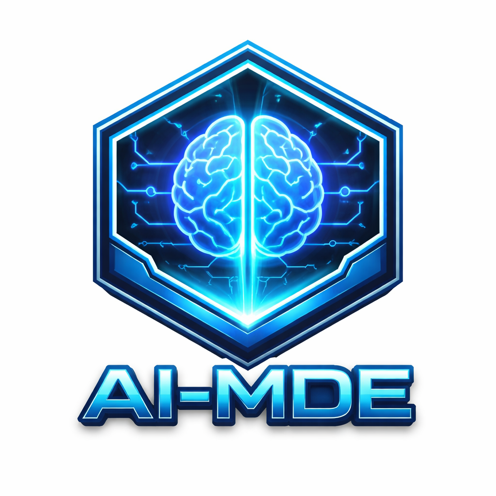
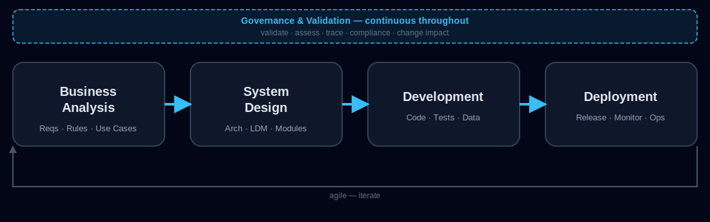
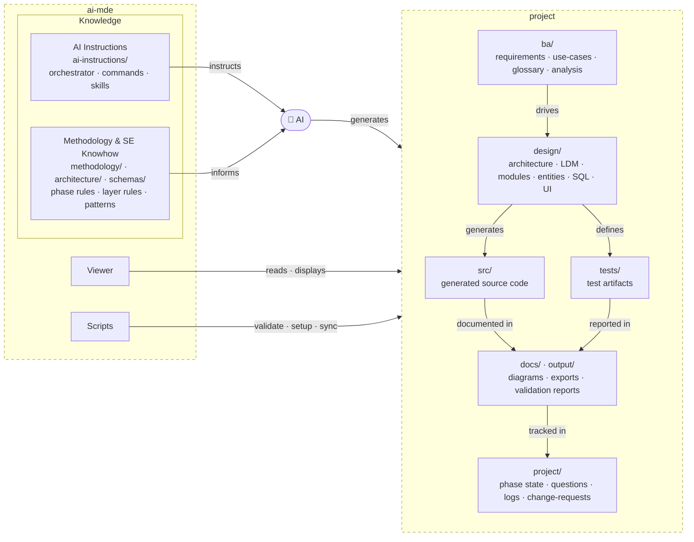

# AI-MDE — AI-Orchestrated Model-Driven Engineering

  

> **Lightweight, AI-orchestrated, model-driven engineering across the full software lifecycle.**

AI-MDE is a lightweight framework that uses **AI orchestration, MCP-connected tools, structured skills, and governed artifacts** to drive the entire lifecycle of software delivery.

It is not limited to business analysis. It covers:

- business analysis
- architecture and design
- development guidance
- testing and validation
- change management and re-evaluation
- generation of both **documentation and code**

AI makes this practical without forcing teams into a heavy traditional Model-Driven Engineering platform.

---

## Why AI-MDE exists

Most teams still work in one of two bad modes:

1. **manual lifecycle work** that is slow, fragmented, and hard to keep aligned
2. **ad-hoc AI prompting** that is fast but inconsistent, ungoverned, and hard to trust

AI-MDE is meant to fix that.

It combines the discipline of model-driven engineering with the flexibility of modern AI. The result is a **lightweight lifecycle engine** that can derive, refine, validate, and generate the artifacts needed to move from idea to implementation.

---

## What AI-MDE is

AI-MDE is:

- a **lightweight model-driven engineering approach**
- an **AI orchestration layer** for lifecycle work
- a **governed process** for turning raw inputs into structured outputs
- a framework that uses **MCPs, tools, skills, and rules** to drive execution
- a system that can generate **documents, models, specifications, test assets, and code**

AI-MDE is not:

- just a BA assistant
- just a prompt library
- just a code generator
- a heavy enterprise CASE tool
- a replacement for engineering judgment

---

## Core idea

AI-MDE treats the lifecycle as a connected flow of derivation and validation:

**Raw Inputs → Business Analysis → System Design → Development → Deployment — with Governance & Validation throughout**

> Full phase details: [Lifecycle](./docs/help/lifecycle.md)

  

- **ai-mde** — the framework repo: AI instructions and a knowledge base of methodology, architecture rules, and SE patterns that guide every decision the AI makes
- **🧠 AI** — orchestrated reasoning engine that reads the knowledge base and generates all lifecycle artifacts
- **project** — a Git repository holding every artifact the AI produces: requirements, design, code, tests, docs, and change records

> See [Tool Parts](./docs/help/tool-parts.md) for a full breakdown.

---

## Role of AI orchestration

AI is not answering prompts — it is orchestrated to analyze, derive, validate, generate, and regenerate lifecycle artifacts in a controlled, governed pipeline.

---

## Role of MCPs

MCPs connect the AI to tools and environments so it can read and write artifacts, invoke validators, and trigger workflows — beyond chat.

---

## The role of MDE

MDE is the discipline that makes AI outputs governable — explicitly modeling artifacts, phases, rules, trace links, and change relationships.

---

## What AI-MDE generates

Documentation, structured artifacts (JSON models, specs, rule catalogs), and code-related outputs (scaffolds, schemas, DTOs, service skeletons, generated code) — across the full lifecycle.

---

## Managed workspace

A Git repository holds all lifecycle artifacts — BA, design, code, tests, change records, and traceability data — versioned, reviewable, and auditable.

---

## Project viewer

A local browser dashboard (`npm run viewer -- --root=<project>` → `http://localhost:4000`) shows phase status, artifact library, command history, open questions, and traceability.

---

## Install and Quick Guide
[Install instructions](./docs/help/install.md)

[How to use](./docs/help/how-to-use-mde.md)

[Lifecycle](./docs/help/lifecycle.md)

[MDE glossary](./docs/help/mde-glossary.md)

---

## Summary

**AI-MDE is a lightweight, AI-orchestrated, model-driven engineering framework that uses structured lifecycle control, MCP-connected tools, and governed artifacts to drive project initiation, business analysis, system design, development, governance, and change management across the full software lifecycle.**

AI-MDE turns AI from a prompting assistant into a **lightweight lifecycle engine** — not just for analysis, not just for design, not just for code, but for the whole flow.
