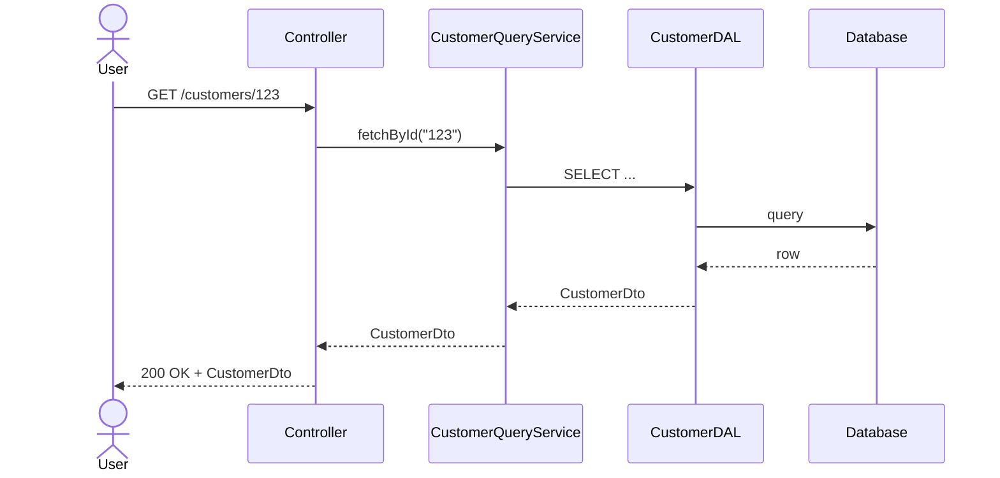
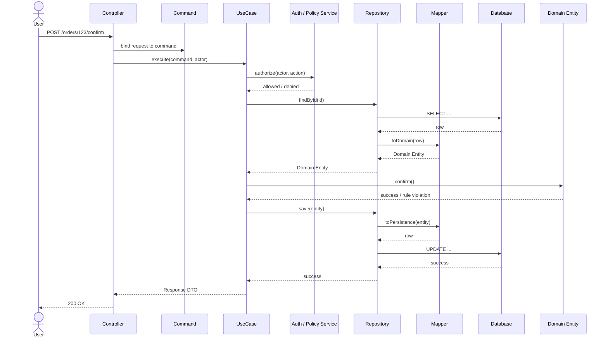

# Business App Layering Notes

## Purpose

This document defines the recommended multi-layer architecture for business applications, covering how controllers, use cases, domain entities, query services, repositories, mappers, and DTOs interact.

---

# Architecture Position

## Core principle

- **Domain Entity in all major modules** — yes
- **All business logic in Domain Entity** — no
- **Core object truth in Domain Entity** — yes
- **Workflow and authorization in UseCase** — yes
- **Read/projection logic in QueryClass** — yes

## The three flows

### Read flow

```text
Controller
 -> QueryClass
 -> DAL / Repository
 -> Read DTO
 -> Controller
```

### Write flow — operation-specific

```text
Controller
 -> Command
 -> UseCase
 -> Repository
 -> DB
 -> Response DTO
 -> Controller
```

### Write flow — rich domain behavior

```text
Controller
 -> Command / UseCase
 -> Repository
 -> Domain Entity
 -> Repository
 -> Response DTO
 -> Controller
```

---

# Layer Responsibilities

## Controller

- Bind HTTP request to a Command
- Call a UseCase or QueryService
- Return HTTP response from result DTO
- No business logic

## Command

- Typed input for a single operation
- Fields only, no behavior
- Scoped to one operation (not reused across operations)

Example:

```ts
type UpdateCustomerProfileCommand = {
  customerId: string;
  fullName: string;
  email: string;
};
```

## UseCase

Owns workflow, orchestration, and application-level concerns:

- Action-level authorization checks
- Operations spanning more than one object
- Transaction / repository coordination
- Workflow steps
- Integration side effects
- Audit / event triggering

Examples:

- `ConfirmOrderUseCase`
- `AssignRoleUseCase`
- `SuspendCustomerUseCase`

## Domain Entity

Owns truth about the business object itself:

- Object identity and state
- Invariants about that object
- Legal and illegal state transitions
- Business behavior that belongs to the object

Examples:

```ts
class Order {
  confirm(): void {
    if (this.status !== "pending") throw new DomainError("Only pending orders can be confirmed");
    this.status = "confirmed";
  }
}
```

Good entity rules:
- a suspended customer cannot place an order
- an order with no items cannot be confirmed
- a closed invoice cannot add more lines
- end date must be after start date

Do **not** put these in the entity:
- HTTP / controller concerns
- DAL / repository calls
- Session or request context
- User role checks from ACL tables
- Multi-object workflow coordination
- UI-specific shaping logic

## QueryService

Owns read operations:

- Fetch by id
- List / search / filter
- Read-model shaping
- Joins and projections for screens
- DTO construction

QueryServices should be stateless. Do not store per-request mutable state inside them.

Example:

```ts
class CustomerQueryService {
  constructor(private readonly db: DbClient) {}

  async fetchById(id: string): Promise<CustomerDto | null> {
    const row = await this.db.query("SELECT ...", [id]);
    return row ? toDto(row) : null;
  }
}
```

## Repository (port)

The Repository is defined as an **interface (port)** in the application layer. The implementation lives in the infrastructure layer.

Application layer defines:

```ts
// application/ports/customer.repository.ts
interface CustomerRepository {
  findById(id: string): Promise<Customer | null>;
  insert(customer: Customer): Promise<void>;
  save(customer: Customer): Promise<void>;
}
```

Infrastructure layer implements:

```ts
// infrastructure/postgres-customer.repository.ts
class PostgresCustomerRepository implements CustomerRepository {
  async findById(id: string): Promise<Customer | null> { ... }
  async insert(customer: Customer): Promise<void> { ... }
  async save(customer: Customer): Promise<void> { ... }
}
```

This keeps the application layer free of database dependencies.

## Mapper

The Mapper translates between persistence rows and domain entities. It lives in the infrastructure layer alongside the repository implementation.

```ts
class CustomerMapper {
  static toDomain(row: CustomerRow): Customer {
    return Customer.rehydrate({
      id: row.id,
      fullName: row.full_name,
      status: row.status,
      version: row.version_no,
    });
  }

  static toPersistence(entity: Customer): CustomerRow {
    const state = entity.toPersistenceState();
    return {
      id: state.id,
      full_name: state.fullName,
      status: state.status,
      version_no: state.version,
    };
  }
}
```

Rules for Mappers:
- No business logic — pure field translation
- Column names (snake_case) stay in the mapper and repository, not in the domain
- `toDomain` calls a `rehydrate` factory on the entity (not the public constructor)
- `toPersistence` calls a read accessor on the entity to get raw state

## DTO

A DTO (Data Transfer Object) is used at boundaries:

- API request payloads
- API response payloads
- Read/query results
- Message payloads
- Integration contracts

DTOs are plain objects — fields only, no behavior, easy to serialize.

Do not use DTOs as your internal business model.

---

# Validation Split

Validation is split across layers — do not build one giant validator.

### API / request validation — at the boundary

- Required fields
- Type checks
- Field length
- Format (email, UUID)
- Enum membership

### Domain validation — in the entity

- Impossible state
- Invalid transitions
- Invalid object combinations
- Object invariants

### UseCase validation — in the use case

- Action-level preconditions
- Multi-object checks
- Permission checks tied to the operation

---

# Authorization Split

Authorization is also split.

### UseCase / policy layer — actor-based

- Actor has permission to perform action
- Actor belongs to allowed tenant
- Actor can modify only own region / branch
- Finance can approve invoices
- Manager can suspend only own team members

### Domain Entity — state-based restriction

- Archived record cannot be modified
- Suspended customer cannot place an order
- Approved invoice cannot be deleted

The distinction:

- **Authorization by actor** belongs in the UseCase
- **State-based business restriction** belongs in the entity

---

# Decision Guide

### Put it in Domain Entity if
- it is truth about the object itself
- it is an invariant
- it is a legal / illegal state transition
- it is reusable object behavior

### Put it in UseCase if
- it spans multiple objects
- it depends on the acting user
- it coordinates repositories
- it defines workflow
- it triggers integrations or side effects

### Put it in QueryClass if
- it is just reading
- it shapes a response
- it filters / searches / lists
- it builds a read model

### Put it in Mapper if
- it translates between a DB row and a domain entity
- it handles column name differences (snake_case ↔ camelCase)

---

# Interaction Diagrams

## Read flow



## Write flow — rich domain behavior



---

# Recommended Naming Set

| Role | Example name |
|---|---|
| Controller | `CustomerController` |
| Command | `UpdateCustomerProfileCommand` |
| UseCase | `UpdateCustomerProfileUseCase` |
| Domain Entity | `Customer` |
| Repository port | `CustomerRepository` (interface) |
| Repository impl | `PostgresCustomerRepository` |
| Mapper | `CustomerMapper` |
| QueryService | `CustomerQueryService` |
| Read DTO | `CustomerDto` |
| Response DTO | `UpdateCustomerProfileResponse` |

---

# Appendix: Background Discussion

The sections below capture the design discussion that led to the position above. They are preserved for context.

---

## A1. DTO

A DTO is a **Data Transfer Object**.

In practice:
- plain object
- fields only
- no business behavior
- easy to serialize to JSON

A DTO is for **moving data**, not for owning business rules.

---

## A2. DAL

DAL is the **Data Access Layer**.

Responsibilities:
- query the database
- save data
- map database rows into DTOs or persistence models
- isolate storage details from upper layers

DAL should focus on persistence, not business decisions.

---

## A3. BO

In early discussions, **BO** meant the class sitting between controller and DAL.

```text
Controller -> BO -> DAL
```

In the final architecture, that BO is more precisely named one of:
- `UseCase`
- `QueryService`
- `ApplicationService`

The name matters less than the responsibility.

---

## A4. Query Service vs Domain Entity

**Query Service** is for reads — stateless, returns DTOs.

**Domain Entity** is stateful — it represents the business object and owns its own business state.

Rule:
- Query Service: stateless
- Domain Entity: stateful in its own business state

---

## A5. Why not bind the full request to a giant entity graph

Binding a request directly to an ORM-tracked entity graph causes:
- which child is new / changed / deleted?
- ordering issues
- cascade issues
- partial update confusion

Better:
```text
Request DTO
 -> command / use-case input
 -> load current data
 -> apply explicit changes
 -> save deliberately
```

---

## A6. Explicit child updates are better than graph replacement

Bad:
```ts
order.items = dto.items.map(...)
```

Safer:
```ts
order.addItem(...)
order.changeItemQuantity(...)
order.removeItem(...)
```

Or separate command-specific use cases:
- `AddCustomerAddressUseCase`
- `RemoveCustomerAddressUseCase`
- `UpdateOrderItemQuantityUseCase`

---

## A7. When Domain Entities still make the most sense

Domain Entities add the most value when:
- the business object has a real lifecycle
- the object owns strong invariants
- behavior is reused across multiple use cases
- state transitions matter

Less useful for:
- simple lookup screens
- list / report queries
- trivial admin CRUD
- large graph-based UI editing with weak business rules
