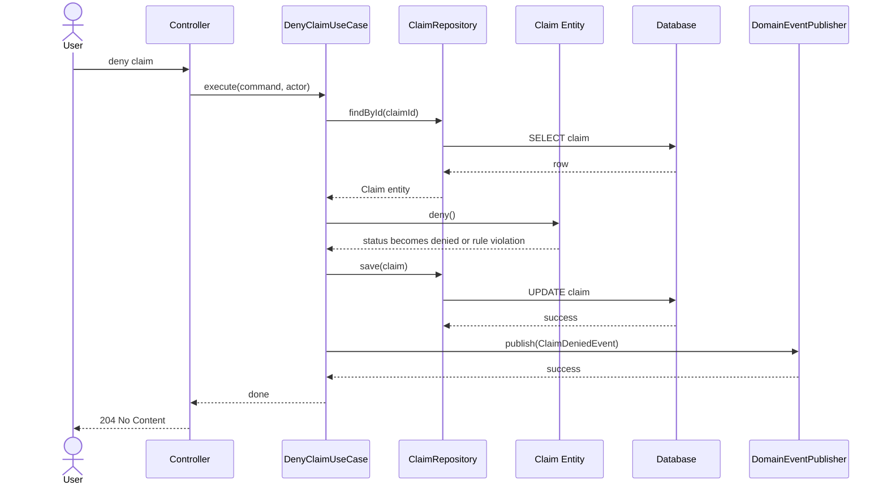
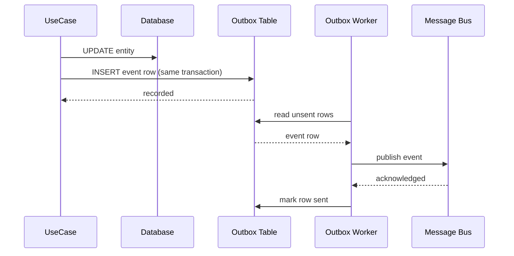

# Business Events in the Architecture

## Purpose

This document defines where business events fit in the architecture and how a business event like `ClaimDenied` flows through the system.

The architecture:

- **Domain Entity** — owns object truth and state transitions
- **UseCase** — owns workflow, authorization, and orchestration
- **QueryService** — owns reads
- **Infrastructure / Adapter** — owns persistence, messaging, external systems
- **DTO** — used at boundaries and for event contracts

---

## Responsibility split

| Layer | Role in events |
|---|---|
| Domain Entity | Decides whether the state change is legal. Does not emit events. |
| UseCase | Decides that an event should be emitted after a successful business action. Creates the event object. |
| Infrastructure | Decides how the event is delivered. Implements the publisher interface. |

---

## Example: `ClaimDenied`

When a claim is denied:

1. Actor is authorized
2. Claim is loaded
3. Domain Entity allows the denial (`claim.deny()`)
4. Claim is saved
5. UseCase emits a `ClaimDenied` event through the publisher port

```text
Controller
 -> DenyClaimUseCase
 -> ClaimRepository.findById()
 -> Claim.deny()
 -> ClaimRepository.save()
 -> DomainEventPublisher.publish(ClaimDenied)
 -> return response
```

---

## Interaction diagram



---

## Event contract shape

Events use a **typed envelope** pattern — one base type for the publisher, specific payload types per event.

### Base envelope

```ts
// shared/events/domain-event.ts
export type DomainEvent<T = unknown> = {
  eventType: string;
  occurredAt: string;
  aggregateId: string;
  aggregateType: string;
  payload: T;
};
```

Used by the publisher interface and infrastructure — generic, serialisable.

### Specific event types

```ts
// {module}/dto/{module}.events.ts
export type ClaimDeniedEvent = DomainEvent<{
  claimId: string;
  claimNumber: string;
  claimantId: string;
  reason: string;
}>;

export type ClaimApprovedEvent = DomainEvent<{
  claimId: string;
  claimNumber: string;
  claimantId: string;
  approvedAmount: number;
}>;
```

Each specific type is a declaration only — no extra classes, just a constrained alias of the base.

### Who uses what

| Layer | Uses |
|---|---|
| UseCase (producer) | Specific typed event — full payload type safety |
| Publisher interface | Base `DomainEvent` — accepts any event |
| Infrastructure | Base `DomainEvent` — serialises generically |
| Consumer | Narrows by `eventType` discriminator to access typed payload |

Event contracts live in the `dto` layer of the owning module.

---

## Publisher interface

The UseCase depends on an interface (port), not an implementation.

```ts
export interface DomainEventPublisher {
  publish(event: DomainEvent): Promise<void>;
}
```

The infrastructure layer provides the implementation — database outbox, message bus, or any other delivery mechanism. The UseCase does not know or care which.

This keeps the delivery mechanism replaceable without touching business logic.

---

## Who creates the event

**Pattern A (recommended): UseCase creates the event from entity state**

```ts
claim.deny(now);
await claimRepository.save(claim);

const s = claim.getSnapshot();
const event: ClaimDeniedEvent = {
  eventType: "ClaimDenied",
  occurredAt: now.toISOString(),
  payload: {
    claimId: s.id,
    claimNumber: s.claimNumber,
    claimantId: s.claimantId,
    status: s.status
  }
};
await eventPublisher.publish(event);
```

Simple, explicit, easy to test.

**Pattern B: Entity records domain events internally**

The entity accumulates pending events; the UseCase dispatches them after save. Useful in richer event-driven models but adds machinery. Start with Pattern A.

---

## Delivery options

**Option 1 — Publish immediately after save**

Simple. Risk: if save succeeds but publish fails, the event is lost.
Acceptable for low-stakes notifications.

**Option 2 — Outbox Pattern (recommended when reliability matters)**

```text
1. save entity
2. insert event row in same DB transaction
3. background worker reads unsent rows
4. worker delivers to message bus
5. row marked as sent
```

Outbox flow:



Eliminates lost events when reliability matters.

---

## What can consume events

- notification service
- audit logger
- reporting pipeline
- fraud / risk service
- downstream systems
- analytics

One business event, many independent consumers.

---

## Where NOT to put event concerns

- **Domain Entity** — must not import a publisher or know about delivery
- **Controller** — must not publish events directly
- **QueryService** — reads must not emit events

---

## Folder structure

```text
{module}/
  application/
    use-cases/
      deny-claim.use-case.ts
    ports/
      domain-event-publisher.ts      ← interface (port)
  domain/
    {module}.entity.ts
  infrastructure/
    messaging/
      outbox-event-publisher.ts      ← implementation
    persistence/
      outbox.repository.ts           ← if using outbox pattern
```

---

## Reference

- Architecture: `mde/architecture/architecture.json`
- Layering guide: `mde/docs/design/business-app-layering.md`
