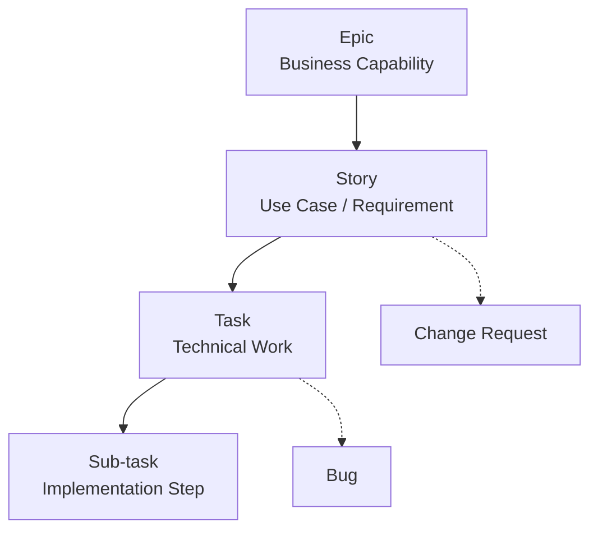
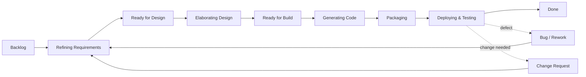
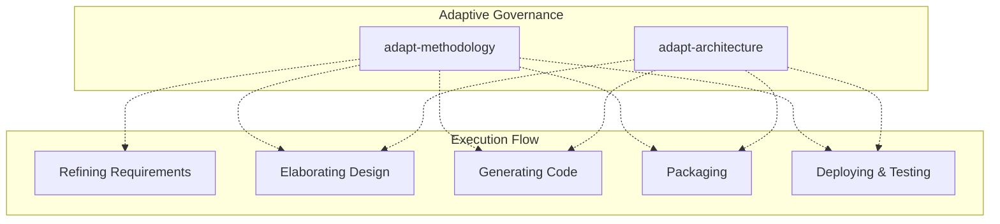
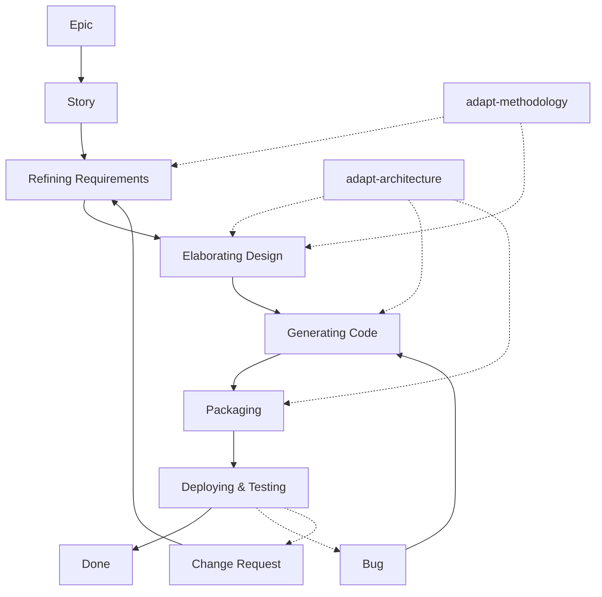

# AI-MDE ↔ Jira Integration Model

## 🎯 Purpose

This document defines how the **AI-MDE command model** integrates with **Jira workflows**, aligning business analysis, design, development, and deployment with Agile/Scrum practices.

---

# 🧭 1. AI-MDE Command Model

## Adaptive Governance

* `adapt-architecture`
* `adapt-methodology`

## Execution Pipeline

* `refine-business-requirements`
* `elaborate-system-design`
* `generate-source-code`
* `package-application`
* `deploy-and-test`

---

# 🔷 2. Jira Issue Hierarchy



## Mapping

| Jira Type      | Meaning                    |
| -------------- | -------------------------- |
| Epic           | Business Capability        |
| Story          | Use Case / Requirement     |
| Task           | Design / Code / Build work |
| Sub-task       | Implementation detail      |
| Bug            | Defect                     |
| Change Request | Requirement change         |

---

# 🔷 3. Workflow States



---

# 🔷 4. Adaptive Governance Overlay



---

# 🔷 5. Recommended Jira Status Model

```text
Backlog
Refining Requirements
Ready for Design
Elaborating Design
Ready for Build
Generating Code
Packaging
Deploying & Testing
Done
Blocked
```

Optional:

```text
Bug / Rework
Change Requested
```

---

# 🔷 6. Transition Rules

* Backlog → Refining Requirements
* Refining Requirements → Ready for Design
* Ready for Design → Elaborating Design
* Elaborating Design → Ready for Build
* Ready for Build → Generating Code
* Generating Code → Packaging
* Packaging → Deploying & Testing
* Deploying & Testing → Done

### Exceptions:

* Deploying & Testing → Bug / Rework
* Deploying & Testing → Change Requested

---

# 🔷 7. Field Mapping

## Epic

* Capability Name
* Business Goal
* Stakeholders
* Constraints

## Story

* Use Case
* Acceptance Criteria
* Business Rules
* Assumptions
* Dependencies

## Task

* Module
* Interfaces
* Technical Notes

## Bug

* Steps to Reproduce
* Expected vs Actual
* Severity

## Change Request

* Description
* Reason
* Impact Analysis

---

# 🔷 8. Scrum Mapping

| Scrum Event        | AI-MDE Command               | Jira Stage            |
| ------------------ | ---------------------------- | --------------------- |
| Backlog Refinement | refine-business-requirements | Refining Requirements |
| Sprint Planning    | elaborate-system-design      | Elaborating Design    |
| Development        | generate-source-code         | Generating Code       |
| Build              | package-application          | Packaging             |
| Review / QA        | deploy-and-test              | Deploying & Testing   |
| Retrospective      | adapt-*                      | Governance            |

---

# 🔷 9. End-to-End Flow



---

# 🚀 10. Summary

This model aligns:

* **AI-MDE** → engineering discipline
* **Jira** → execution tracking
* **Scrum** → delivery cadence

### Core idea:

> Adapt → Refine → Elaborate → Generate → Package → Deploy → Repeat

This creates a **continuous, controlled, and traceable software engineering lifecycle**.
