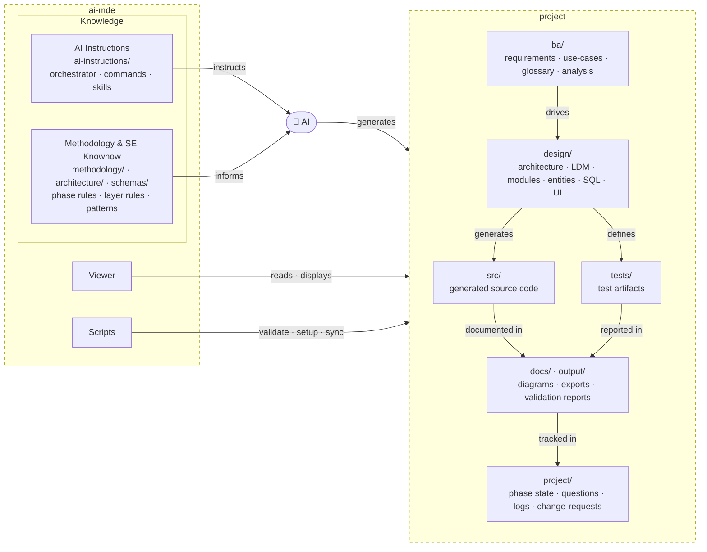

# AI-MDE Tool Parts

AI-MDE has three knowledge parts and two actors.

See also: [AI-MDE Glossary](./mde-glossary.md)

---

## ai-mde repo

### 1. AI Instructions — `ai-instructions/`

The source of truth for the AI engine. Loaded at the start of every session via `CLAUDE.md` / `AGENT.md`.

| File | Purpose |
|---|---|
| `orchestrator.json` | Phase rules, command resolution, execution pipeline, post-command obligations |
| `commands/*.json` | One file per command — phase, prerequisites, skills to invoke, output contract |
| `skills/*.json` | One file per skill — reasoning steps, rules the AI must follow, what to produce |

Read-only at runtime. No AI command or skill writes into this folder.

---

### 2. Methodology & SE Knowhow — `methodology/` · `architecture/` · `schemas/`

The engineering discipline that governs what the AI produces and how it reasons.

| Folder | What it contains |
|---|---|
| `methodology/` | Phase definitions, required artifacts per phase, discovery loop rules, document types |
| `architecture/` | Layer rules, module type rules, audit rules, SOLID guidelines, architecture constraints |
| `schemas/` | JSON schemas for requirements, trace matrix, module tests, configuration |

Read-only at runtime. Skills use these to validate and guide what they generate.

---

### 3. Tools

| Tool | Description |
|---|---|
| **Scripts** `scripts/` | Node.js utilities for project setup, validation, and doc sync — run from the terminal |
| **Viewer** `web/` | Local browser dashboard at `http://localhost:4000` for reviewing project artifacts and phase status |

See [getting started](./getting-started.md) for usage details.

---

## Project Repository

The shared state everything acts on — generated into by the AI, displayed by the Viewer, validated by Scripts.

| Folder | Contains |
|---|---|
| `ba/` | Requirements, use cases, glossary, analysis status, discovery inbox |
| `design/` | Architecture, LDM, modules, entities, SQL schema, UI outline |
| `src/` | Generated source code |
| `tests/` | Test artifacts |
| `output/` · `docs/` | Generated documentation, diagrams, exports, validation reports |
| `project/` | Phase state, questions, open issues, command log, change requests |
| `Requests/` | Incoming change request source files |
