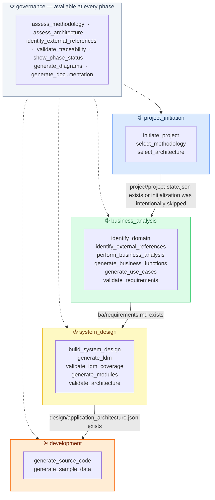

# MDE Workflow Lifecycle
> Generated from `mde/ai-instructions/orchestrator.json`

---

## Command Availability by Phase

| Command | ① project initiation | ② business analysis | ③ system design | ④ development | ⟳ always |
|---------|----------------------|---------------------|-----------------|---------------|----------|
| `initiate_project` | ✓ |  |  |  |  |
| `select_methodology` | ✓ |  |  |  |  |
| `select_architecture` | ✓ |  |  |  |  |
| `identify_domain` |  | ✓ |  |  |  |
| `identify_external_references` |  | ✓ |  |  | ✓ |
| `perform_business_analysis` |  | ✓ |  |  |  |
| `generate_business_functions` |  | ✓ |  |  |  |
| `generate_use_cases` |  | ✓ |  |  |  |
| `validate_requirements` |  | ✓ |  |  |  |
| `build_system_design` |  |  | ✓ |  |  |
| `generate_ldm` |  |  | ✓ |  |  |
| `validate_ldm_coverage` |  |  | ✓ |  |  |
| `generate_modules` |  |  | ✓ |  |  |
| `validate_architecture` |  |  | ✓ |  |  |
| `generate_source_code` |  |  |  | ✓ |  |
| `generate_sample_data` |  |  |  | ✓ |  |
| `assess_methodology` |  |  |  |  | ✓ |
| `assess_architecture` |  |  |  |  | ✓ |
| `validate_traceability` |  |  |  |  | ✓ |
| `show_phase_status` |  |  |  |  | ✓ |
| `generate_diagrams` |  |  |  |  | ✓ |
| `generate_documentation` |  |  |  |  | ✓ |

---

## Phase Summary

| # | Phase | Entry Condition | Exit Condition |
|---|-------|----------------|----------------|
| ① | `project_initiation` | — | ../../project/project-state.json exists or initialization was intentionally skipped |
| ② | `business_analysis` | — | ../../ba/requirements.md exists, ../../ba/analysis-status.md exists, ../../project/questions.json exists, ../../project/open-queue.json exists |
| ③ | `system_design` | ../../ba/requirements.md exists | ../../design/application_architecture.json exists, ../../design/modules/module-catalog.json exists, at least one module definition exists in design/modules/ |
| ④ | `development` | schema.json exists for target module | development artifacts exist for the target command |
| ⟳ | `governance` | — | — |

> Solid arrows = phase progression. Dashed arrows = governance commands available at every phase.
